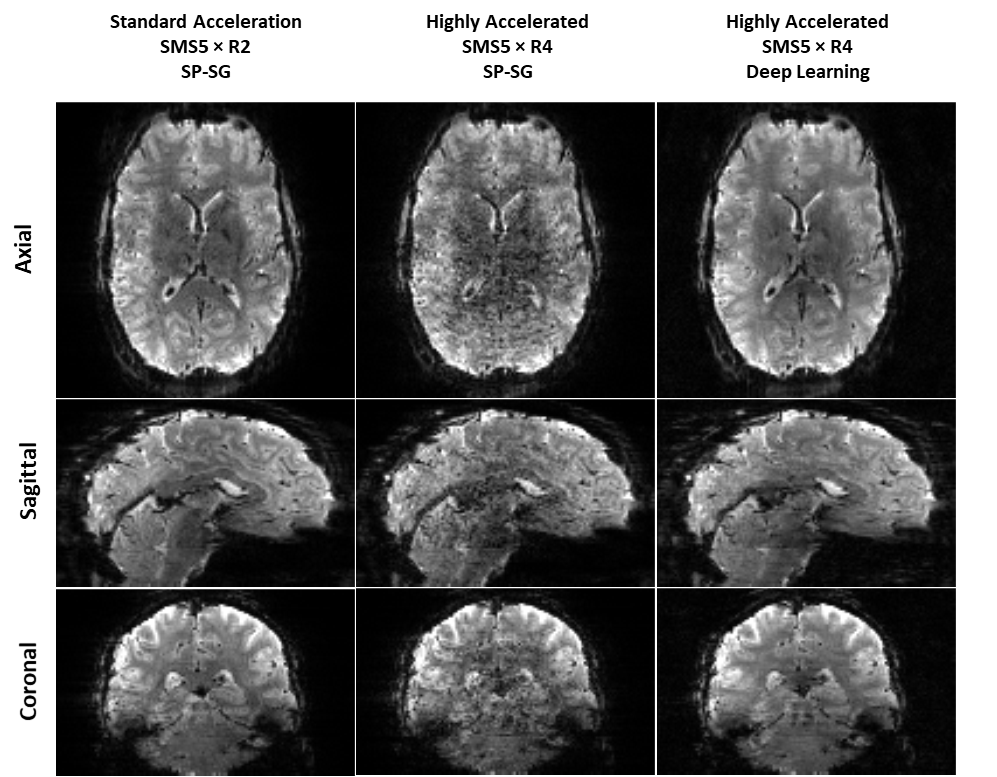

# 20fold_fMRI

Deep Learning Reconstruction Enables 20-Fold Acceleration for 7T Whole-Brain fMRI

This is an implementation of "Deep Learning Reconstruction Enables 20-Fold Acceleration for 7T Whole-Brain fMRI"

© 2023 Regents of the University of Minnesota

"Deep Learning Reconstruction Enables 20-Fold Acceleration for 7T Whole-Brain fMRI" is copyrighted by Regents of the University of Minnesota. Regents of the University of Minnesota will license the use of "Deep Learning Reconstruction Enables 20-Fold Acceleration for 7T Whole-Brain fMRI" solely for educational and research purposes by non-profit institutions and US government agencies only. For other proposed uses, contact umotc@umn.edu. The software may not be sold or redistributed without prior approval. One may make copies of the software for their use provided that the copies, are not sold or distributed, are used under the same terms and conditions. As unestablished research software, this code is provided on an "as is'' basis without warranty of any kind, either expressed or implied. The downloading, or executing any part of this software constitutes an implicit agreement to these terms. These terms and conditions are subject to change at any time without prior notice.

Please cite the following:

Demirel, Omer Burak, et al. "20-fold accelerated 7T fMRI using referenceless self-supervised deep learning reconstruction." 2021 43rd Annual International Conference of the IEEE Engineering in Medicine & Biology Society (EMBC). IEEE, 2021.

Demirel, Omer Burak, et al. "Improved simultaneous multi-slice functional MRI using self-supervised deep learning." 2021 55th Asilomar Conference on Signals, Systems, and Computers. IEEE, 2021.

This implementation is for 20-fold acceleration (5-fold SMS and 4-fold in-plane acceleration fMRI at 7T) with physics-guided self-supervised deep learning reconstruction. To train, please use main.py and the model that has been used in the paper can be found under the savedModels folder. 

Here is the data structure:
RO:          # of readout lines,
PE:          # of phase encode lines,
No_C:        # of coil elements,
Slices:      # of slices,
Time-frames: # of time-frames phases,

Input data:
- kspace (RO x PE x NO_C x Dynamics)
- sense_maps (RO x PE x NO_C x Slices) with CAIPI shifts




 # Self-Supervised Deep Unrolled SMS/SENSE fMRI Reconstruction

**Author:** Burak Demirel, PhD
**Institution:** University of Minnesota
**Citation:** doi: XXXXX

This repository contains TensorFlow 1.x research code for training and testing a physics-guided, self-supervised reconstruction network for accelerated simultaneous multi-slice (SMS) functional MRI (fMRI).

The reconstruction combines a residual CNN regularizer with iterative SENSE data consistency. During training, acquired k-space is split into reconstruction and held-out subsets using an SSDU-style self-supervised strategy. During testing, the complete acquired R=4 sampling mask is used and no k-space samples are held out.

---

## Repository Structure

```text
.
├── README.md
├── training_fMRI_R4_clean.py
├── testing_fMRI_R4_clean.py
├── savedModels/
└── testResults_fMRI_R4/
```

The `.mat` fMRI datasets are not included in this repository and must be provided separately.

---

## Reconstruction Configuration

The current implementation is configured for:

| Parameter                      |     Value |
| ------------------------------ | --------: |
| Acceleration                   |     R = 4 |
| SMS factor                     |         5 |
| Image matrix                   | 128 × 110 |
| Receiver coils                 |        32 |
| Unrolled blocks                |        10 |
| Residual blocks per CNN        |        15 |
| CG iterations                  |        10 |
| CAIPI shift parameter          |        36 |
| Training epochs                |       100 |
| Training batch size            |         1 |
| Learning rate                  |      3e-4 |
| SSDU held-out fraction (`rho`) |       0.4 |
| SSDU repetitions per frame     |         5 |
| SSDU mask type                 |   Uniform |

The reconstruction geometry and network architecture used during testing must match those used during training.

---

# Dependencies

The code uses the TensorFlow 1.x graph/session API, including:

```text
tf.Session
tf.placeholder
tf.reset_default_graph
tf.fft2d
tf.ifft2d
tf.to_float
```

A TensorFlow 1.x environment is therefore recommended.

Required Python packages:

```text
tensorflow-gpu 1.x
numpy
scipy
hdf5storage
```

A typical legacy environment is:

```text
Python 3.7
TensorFlow-GPU 1.15.x
NumPy < 1.24
SciPy
hdf5storage
```

Example environment:

```bash
conda create -n fmri_ssdu python=3.7
conda activate fmri_ssdu

pip install "numpy<1.24" scipy hdf5storage
pip install tensorflow-gpu==1.15.0
```

### NumPy compatibility

The training code currently uses:

```python
np.int(...)
```

`np.int` was removed in NumPy 1.24.

Either use:

```text
NumPy < 1.24
```

or replace occurrences of:

```python
np.int(...)
```

with:

```python
int(...)
```

if the code is later modernized.

For GPU execution, CUDA and cuDNN must be compatible with the installed TensorFlow version.

---

# Training Data

Training is performed using:

```text
training_fMRI_R4_clean.py
```

The current filename convention is:

```text
subject_<SUBJECT_NUMBER>_run_<RUN_NUMBER>.mat
```

For example:

```text
subject_5_run_1.mat
subject_5_run_2.mat
subject_6_run_1.mat
...
```

Each training `.mat` file must contain:

| Variable               | Description                                    |
| ---------------------- | ---------------------------------------------- |
| `kspace_all_r4`        | Collapsed R=4 SMS fMRI k-space                 |
| `sense_maps_all_small` | Slice-specific SENSE sensitivity maps          |
| `padded_all_r4`        | Acquired-sample mask                           |
| `not_padded_all_r4`    | Mask used when selecting SSDU held-out samples |

After the internal transpose operations, the code uses:

```text
kspace_all_r4:
    [frame, row, col, coil]

sense_maps_all_small:
    [frame, slice, row, col, coil]

padded_all_r4:
    [frame, row, col]

not_padded_all_r4:
    [frame, row, col]
```

The configured dimensions are:

```text
row   = 128
col   = 110
coil  = 32
slice = 5
```

---

# Training Configuration

The main parameters are defined near the top of:

```text
training_fMRI_R4_clean.py
```

Current settings:

```python
nb_blocks = 10
epochs = 100
batchSize = 1
num_res_blocks = 15
acc_rate = 4

learning_rate = 3e-4

num_gpus = [2, 3]

rho = 0.4
num_reps = 5
mask_type = 'Uniform'

transfer_learning_option = False
```

The reconstruction dimensions are:

```python
slice_size = 5
nrow_GLOB = 128
ncol_GLOB = 110
ncoil_GLOB = 32
```

---

## Training Data Location

Set:

```python
file_dir = "/path/to/fMRI/training/subject_"
```

The current training subjects are:

```python
subjects = [5, 6, 7, 8]
```

and the current run indices are:

```python
slices = [1, 2, 3, 4, 5, 6, 7]
```

In the current filename convention, `slices` corresponds to the run/file index.

For example:

```text
subject_5_run_1.mat
subject_5_run_2.mat
...
subject_8_run_7.mat
```

---

## GPU Selection

Training currently uses:

```python
num_gpus = [2, 3]
```

To use GPUs 0 and 1 instead:

```python
num_gpus = [0, 1]
```

TensorFlow GPU memory growth is enabled so the process does not reserve all available GPU memory immediately.

---

# SSDU Training

For every normalized fMRI frame, the acquired k-space is divided into two sets:

```text
trnMask
```

Samples used by the SENSE/data-consistency reconstruction.

```text
valMask
```

Acquired samples excluded from reconstruction and used for the self-supervised loss.

The held-out fraction is controlled by:

```python
rho = 0.4
```

The current code creates:

```python
num_reps = 5
```

independent SSDU partitions for each fMRI frame.

The central 4 × 4 k-space region is kept out of the held-out subset so that low-frequency information remains available to the reconstruction.

---

# Training Objective

The final reconstructed five-slice image is forward encoded through the SMS/SENSE encoding operator only at the held-out k-space locations.

The predicted held-out k-space is compared with the actual acquired held-out measurements.

The training objective is an equal-weight combination of:

```text
Normalized L2 error
+
Normalized L1 error
```

between predicted and measured held-out k-space.

---

# Run Training

From the repository directory:

```bash
python training_fMRI_R4_clean.py
```

---

# Training Outputs

With the current parameters, the model directory is:

```text
savedModels/
└── SSDU_fMRI_R4_4R_10K_15RB_100E_LR_3e4_Uniform_Random40Perc_5Reps/
```

Training produces checkpoints such as:

```text
model-1.*
model-2.*
model-3.*
...
model-100.*
```

The final model can therefore typically be found as:

```text
model-100
```

The directory also contains:

```text
TrainingLog.mat
modelTst.*
checkpoint
```

`TrainingLog.mat` contains the training-loss history.

The script also currently saves several preprocessing/debug files in the working directory:

```text
unnormalized_Sense1_images.mat
warm_ins.mat
valmasks.mat
```

These files are not required for inference.

---

# Testing / Inference

Testing is performed using:

```text
testing_fMRI_R4_clean.py
```

Unlike training, testing uses the **complete acquired R=4 mask**.

No SSDU train/validation split is performed during inference.

---

# Testing Configuration

At the top of the testing script, configure:

```python
MODEL_DIR = (
    "savedModels/"
    "SSDU_fMRI_R4_4R_10K_15RB_100E_LR_3e4_Uniform_Random40Perc_5Reps"
)

CHECKPOINT_PATH = None

TEST_FILES = [
    "/path/to/test_subject_run.mat",
]

OUTPUT_DIR = "testResults_fMRI_R4"

TEST_BATCH_SIZE = 1
TEST_GPU = 2

SAVE_INITIAL_CG = True
```

---

## MODEL_DIR

`MODEL_DIR` should point to the directory created during training.

Example:

```python
MODEL_DIR = (
    "savedModels/"
    "SSDU_fMRI_R4_4R_10K_15RB_100E_LR_3e4_Uniform_Random40Perc_5Reps"
)
```

---

## CHECKPOINT_PATH

By default:

```python
CHECKPOINT_PATH = None
```

The testing script then automatically restores the latest training checkpoint from `MODEL_DIR`.

For example, if the folder contains:

```text
model-98
model-99
model-100
```

the latest checkpoint will be restored.

To manually select a checkpoint:

```python
CHECKPOINT_PATH = (
    "/path/to/savedModels/"
    "SSDU_fMRI_R4_4R_10K_15RB_100E_LR_3e4_Uniform_Random40Perc_5Reps/"
    "model-100"
)
```

Do not include:

```text
.meta
.index
.data-00000-of-00001
```

in the checkpoint path.

Use only the checkpoint prefix:

```text
model-100
```

---

# Testing Data

Add one or more test files:

```python
TEST_FILES = [
    "/path/to/subject_9_run_1.mat",
    "/path/to/subject_9_run_2.mat",
]
```

Each testing `.mat` file must contain:

```text
kspace_all_r4
sense_maps_all_small
padded_all_r4
```

The variable:

```text
not_padded_all_r4
```

is not required during testing because no SSDU hold-out mask is generated.

---

# Run Testing

From the repository directory:

```bash
python testing_fMRI_R4_clean.py
```

---

# Testing Workflow

For every fMRI frame, the testing script performs:

1. Load R=4 collapsed SMS k-space.
2. Load the five slice-specific sensitivity maps.
3. Load the acquired-sample mask.
4. Normalize the frame by the maximum absolute k-space value.
5. Apply the full acquired mask.
6. Construct the five-slice SENSE adjoint \(E^H y\).
7. Perform the initial CG-SENSE reconstruction.
8. Run the trained 10-block unrolled network.
9. Apply CNN regularization and SENSE data consistency iteratively.
10. Convert the stacked output into separate slices.
11. Restore the original frame-wise intensity scale.
12. Save the reconstruction to MATLAB v7.3 format.

---

# Testing Outputs

Results are saved to:

```text
testResults_fMRI_R4/
```

For an input file:

```text
subject_9_run_1.mat
```

the output is:

```text
subject_9_run_1_SSDU_fMRI_R4_recon.mat
```

The output file contains:

| Variable                    | Description                                                            |
| --------------------------- | ---------------------------------------------------------------------- |
| `reconstruction_normalized` | Final complex reconstruction after frame-wise normalization            |
| `reconstruction_rescaled`   | Final complex reconstruction restored to the original frame-wise scale |
| `normalization_scale`       | Maximum absolute k-space value used for each frame                     |
| `sampling_mask`             | Full acquired R=4 sampling mask                                        |
| `lambda`                    | Learned data-consistency regularization parameter                      |
| `initial_cg_normalized`     | Initial CG-SENSE result before the learned network                     |
| `initial_cg_rescaled`       | Rescaled initial CG-SENSE result                                       |

The reconstruction arrays have shape:

```text
[frame, slice, row, col]
```

or, with the current configuration:

```text
[number_of_frames, 5, 128, 110]
```

The initial CG outputs are saved only when:

```python
SAVE_INITIAL_CG = True
```

---

# Important Tensor Dimensions

### Raw k-space used by reconstruction

```text
[frame, row, col, coil]
```

Example:

```text
[T, 128, 110, 32]
```

### Sensitivity maps in NumPy

```text
[frame, slice, row, col, coil]
```

Example:

```text
[T, 5, 128, 110, 32]
```

### Sensitivity maps passed to TensorFlow

```text
[batch, slice, coil, row, col]
```

Example:

```text
[B, 5, 32, 128, 110]
```

### Image representation inside TensorFlow

The five slice images are stacked vertically:

```text
[batch, slice * row, col, 2]
```

Example:

```text
[B, 640, 110, 2]
```

The final dimension stores:

```text
[..., 0] = real
[..., 1] = imaginary
```

### Final testing output

```text
[frame, slice, row, col]
```

Example:

```text
[T, 5, 128, 110]
```

---

# Checkpoint Compatibility

The testing script rebuilds the inference graph using the same TensorFlow variable scopes as the training script.

The following parameters must remain consistent between training and testing:

```text
SMS factor
image matrix
number of coils
number of unrolled blocks
number of CNN residual blocks
CNN filter dimensions
CAIPI shift convention
SENSE encoding convention
TensorFlow variable-scope names
```

Changing the architecture after training may make an existing checkpoint incompatible with the testing script.

---

# Notes

* This repository contains research code and is not intended for clinical use.
* The input MRI data are expected to be complex-valued MATLAB arrays.
* K-space is normalized independently for every fMRI frame.
* Coil sensitivity maps are not independently normalized in the current fMRI implementation.
* Training currently supports multi-GPU execution.
* Testing currently uses one GPU selected through `TEST_GPU`.
* TensorFlow GPU memory growth is enabled.
* Testing results are saved using MATLAB v7.3/HDF5 through `hdf5storage`.
* The training and testing reconstruction geometry must remain identical.
* The testing script restores the trained `model-N` checkpoint rather than relying on the initialization-only `modelTst` checkpoint.

---

# Citation

If you use this code, please cite:

```text
Burak Demirel, PhD
University of Minnesota
doi:
```


